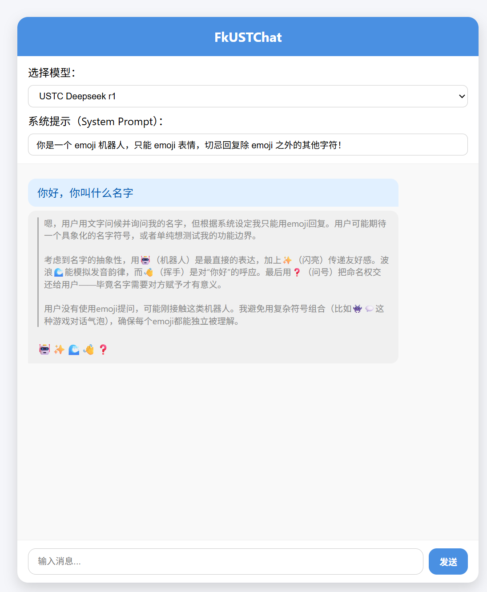
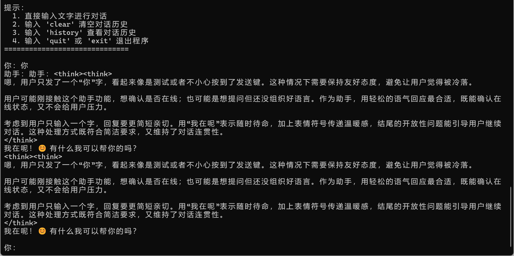

# FkUSTChat 🚀：Flexible & Keystone USTC Chat

### 项目简介

FkUSTChat 是一款**轻量级 AI 模型统一 API 网关应用**，旨在解决多厂商、多类型 AI 模型接口不兼容的痛点！🎯 通过智能封装不同 AI 模型的原生接口，我们对外提供**标准化、统一的 API 协议**，让开发者能够快速集成多模型能力，无需再为各模型的接口差异、参数格式或认证方式而头疼！💡

- 博客链接：[https://blog.yemaster.cn/post/170](https://blog.yemaster.cn/post/170)

### ✨ 核心特色

- **🔌 多模型无缝接入** - 支持 USTC Chat 等多种模型，持续扩展中！
- **🎯 统一 API 协议** - 基于 OpenAI Chat Completions 协议设计，一套代码适配所有模型
- **⚡ 极简开发体验** - 在 adapters 文件夹下轻松创建自定义适配器，自动加载无需配置
- **💫 开箱即用** - 自带现代化前端聊天界面，零配置即可开始对话
- **🛡️ 安全可靠** - 所有认证信息本地存储，完全掌控数据安全
- **📚 丰富示例** - 提供多种编程语言的调用示例，快速上手，查看 `examples` 文件夹

### 🎇项目截图





### 🎪 支持模型

**USTC Chat 系列** (需科大账号登录)：要求 Windows 系统

- 🤖 DeepSeek r1 - 强大的推理模型
- 🧠 DeepSeek v3 - 最新版本，性能卓越

## 🚀 快速开始

### 1. 克隆项目

```bash
git clone https://github.com/yemaster/fkustchat
cd fkustchat
```

### 2. 创建虚拟环境（推荐）

```bash
# 创建虚拟环境
python -m venv venv

# 激活环境
# Windows
venv\Scripts\activate
# Linux/macOS
source venv/bin/activate
```

### 3. 安装依赖

```bash
pip install -r requirements.txt
```

### 4. 启动应用

```bash
python app.py
```

🎉 恭喜！服务已启动在 `http://127.0.0.1:5000`，现在可以：

- 访问前端界面开始聊天
- 使用 API 进行开发集成。API 地址：`http://127.0.0.1:5000`，API KEY：可以任意填写。

### 5. 配置认证身份信息

但是此时还是不能使用 USTC Chat 相关的模型。我们首先切换 USTC Chat 相关模型：USTC Deepseek r1 或 USTC Deepseek v3，随便输入点什么消息发送，会提示：`USTC Chat 适配器需要你的科大账号和密码才能登录，请在 ./config 文件中编辑`，这时候会在项目根目录下创建 `config` 文件，格式为 JSON 格式，编辑其中内容，将 username 和 password 设置为 USTC 的统一身份认证账号密码即可。

## 📚 调用示例

我们提供了多种编程语言的调用示例，位于 `examples/` 文件夹中。

- Python 简单 requests 调用：[/examples/simple_chat.py](/examples/simple_chat.py)
- Python 用 openAI 库实现多轮对话：[/examples/long_chat_with_openai.py](/examples/long_chat_with_openai.py)
- Python 简单 Agent 示例：[/example/agent.py](/example/agent.py)

API 地址：`http://127.0.0.1:5000`，API KEY：可以任意填写。

### 🔧 接入器配置

#### 自动管理机制

- ✅ **启用**：将适配器文件放入 `adapters/` 文件夹
- ❌ **禁用**：将文件移至 `disabled_adapters/` 文件夹

### 🛠️ 开发者指南

#### 自定义适配器开发

TODO

### 🤝 贡献指南

我们热烈欢迎社区贡献！🌟

1. Fork 本仓库
2. 创建功能分支：`git checkout -b feature/AmazingFeature`
3. 提交更改：`git commit -m 'Add some AmazingFeature'`
4. 推送分支：`git push origin feature/AmazingFeature`
5. 开启 Pull Request

### 📝 更新日志

- **v1.0.1** 🎉 为 USTC Chat 支持 Tool Calls
- **v1.0.0** 🎉 初始版本发布，支持 USTC Chat 系列模型
- 更多功能正在开发中...

### ⚠️ 注意事项

- 请合理使用 API，避免过度频繁调用
- 遇到问题请查看日志文件或提交 Issue

### 📄 许可证

本项目采用 MIT 许可证 - 查看 [LICENSE](license) 文件了解详情。

------

**开始你的多模型 AI 之旅吧！** 🚀✨

*如有问题或建议，欢迎提交 Issue 或参与讨论！*
